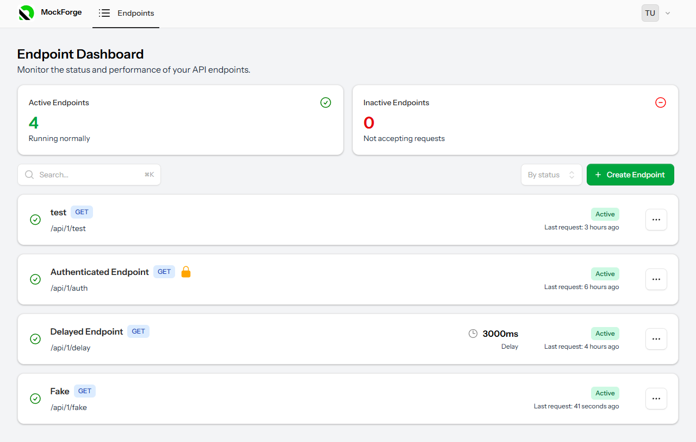

# MockForge️

**MockForge** makes it easy to spin up mock API endpoints for testing, demos, or frontend development — no backend required. Customize your responses, add delays, simulate errors, and get your project moving without waiting on real APIs. Fast, simple, and built for developers.



---

## Features

- **Custom JSON schemas** - Format the data how you want so it fits your project.
- **Simulated response delays** - Simulate a slow server response - great for testing animations, skeletons, etc.
- **Authenticated endpoints** - Add mock token-based auth to your endpoints.
- **Randomized data** - Hard code the data you want, and use templates for randomized data in your response.
    ```
    {
        "name": "{{name}}", -> fake name
        "number": "{{number}}" -> fake number
        "email": "test@test.com" -> hard coded email
    }
    ```
- **Endpoint history** - View requests made to your endpoints.
- **Simple UI** - Get your mock backend up and running in minutes.

---

## Future Ideas

I have no idea if these will actually be implemented, just some ideas I have in my head that might be nice to have.

- User generated JSON payload templates (that are shareable).
- Analytics and more robust request history.
- Endpoints that accept POST, PUT, and DELETE requests.
- Simulated errors (random 404s, 500s, etc).
- Rate limiting.
- JSON payload editor linting.

---

## Tech Stack

MockForge is made with Laravel 12 using the TALL stack.

- Laravel 12
- Livewire
- AlpineJS
- Tailwind CSS

### Laravel Features

- Session based Auth
- Queues / Jobs
- Livewire Forms

---

## Installation

```bash
git clone https://github.com/Blathe/mock-forge.git
cd mock-forge
composer install
npm install
npm run build
cp .env.example .env
php artisan key:generate
php artisan migrate
```
Create 3 terminal tabs and run one command in each:

```
npm run dev
```
```
php artisan serve
```
```
php artisan queue:work
```

