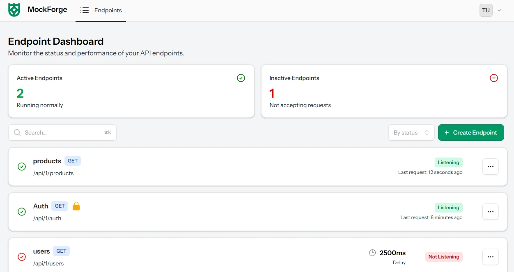

# MockForge

**MockForge** makes it easy to spin up mock API endpoints for testing, demos, or frontend development — no backend required. Customize your JSON responses, add delays, simulate auth, and get your project moving without waiting on a real API.



---

## Features

- **Custom endpoints** — Create mock URLs with your own slug and JSON payload structure.
- **Dynamic JSON with Faker templates** — Mix hardcoded values with auto-generated ones using `{{placeholder}}` syntax:
  ```json
  {
    "name": "{{name}}",
    "email": "{{email}}",
    "age": "{{number}}",
    "bio": "{{string}}",
    "city": "New York"
  }
  ```
  Supported templates: `{{name}}`, `{{email}}`, `{{number}}`, `{{string}}`

- **Configurable HTTP status codes** — Return any status code (200, 201, 404, 500, etc.).
- **Simulated response delays** — Add a delay in milliseconds to test loading states, skeleton screens, and animations.
- **Bearer token auth** — Protect an endpoint with a custom token to simulate authenticated API responses.
- **Endpoint history** — Every request is logged with its HTTP status, response time (ms), and payload size. View history per endpoint from the dashboard.
- **Endpoint visibility toggle** — Endpoints can be enabled or disabled (Listening / Not Listening) without deleting them.
- **In-browser endpoint tester** — Send a test request to your endpoint directly from the dashboard UI.

---

## How It Works

Each endpoint is accessible at:

```
GET https://your-app.com/api/{user_id}/{slug}
```

No authentication is required to hit the endpoint URL itself — authentication is only enforced if you configure a bearer token on the endpoint. The endpoint returns the configured JSON payload, optionally with Faker-generated values substituted in.

### Endpoint Lifecycle

- Endpoints use **soft deletes**. When deleted from the UI, they are soft-deleted first.
- A scheduled job (`DeleteExpiredEndpoints`) runs daily and **permanently deletes** any endpoints that have been soft-deleted for 5 or more days.
- Endpoints are considered **expired** after 7 days from creation (via `Endpoint::isExpired()`).

---

## Tech Stack

Built with the **TALL stack** on Laravel 12:

| Layer | Technology |
|---|---|
| Backend | Laravel 12 (PHP ^8.2) |
| Realtime UI | Livewire + Volt |
| Frontend interactivity | AlpineJS |
| Styling | Tailwind CSS v4 |
| UI Components | Flux UI (`livewire/flux`) |
| JSON Editor | CodeMirror 6 |
| Asset Bundler | Vite |
| Queue | Laravel Queues (database driver) |

---

## Installation

### Prerequisites

- PHP ^8.2
- Composer
- Node.js & npm
- A **Flux UI license** — credentials must be configured before `composer install` will work:
  ```bash
  composer config http-basic.composer.fluxui.dev {your-email} {your-license-key}
  ```

### Steps

```bash
git clone https://github.com/Blathe/mock-forge.git
cd mock-forge
composer install
npm install
cp .env.example .env
php artisan key:generate
touch database/database.sqlite
php artisan migrate
npm run build
```

### Running Locally

The easiest way to start all services at once:

```bash
composer run dev
```

This concurrently runs the Laravel dev server, Vite asset bundler, and queue worker.

Or run each service individually in separate terminals:

```bash
php artisan serve       # Laravel dev server
npm run dev             # Vite asset bundler
php artisan queue:work  # Queue worker (required for endpoint history logging)
```

> **Note:** The queue worker must be running for endpoint request history to be recorded. History is logged asynchronously via the `CreateEndpointHistory` job.

---

## Testing

Tests use an in-memory SQLite database and run jobs synchronously.

```bash
composer run test

# or directly:
php artisan test

# single file:
php artisan test tests/Feature/DashboardTest.php
```

---

## Linting

```bash
vendor/bin/pint
```

---

## Future Ideas

- User-generated and shareable JSON payload templates.
- More robust analytics and request history (filters, charts).
- Support for POST, PUT, and DELETE mock endpoints.
- Simulated random errors (random 404s, 500s, etc.).
- Rate limiting per endpoint.
